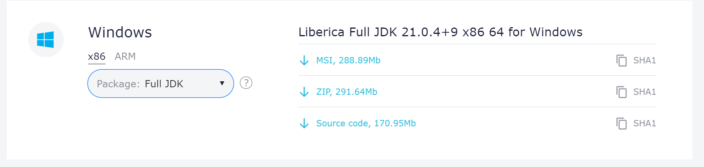

# Biblioteca Gráfica

## Java Graphical User Interface

- AWT
- SWING
- SWT
- JavaFX

## Bellsoft JDK

- JDK para uso mais pratico do JAVAFX
- Ir no site https://bell-sw.com/pages/downloads/
- Descer até a opção da imagem, e clicar em package e mudar para Full JDK

## JAVAFX

- Criar uma classe que herda(extends) ``Apliccation`` do package `import javafx.application.Application;`
- Dentro da Stage, teram Scenes, dentro do Scnes teram Region
- 